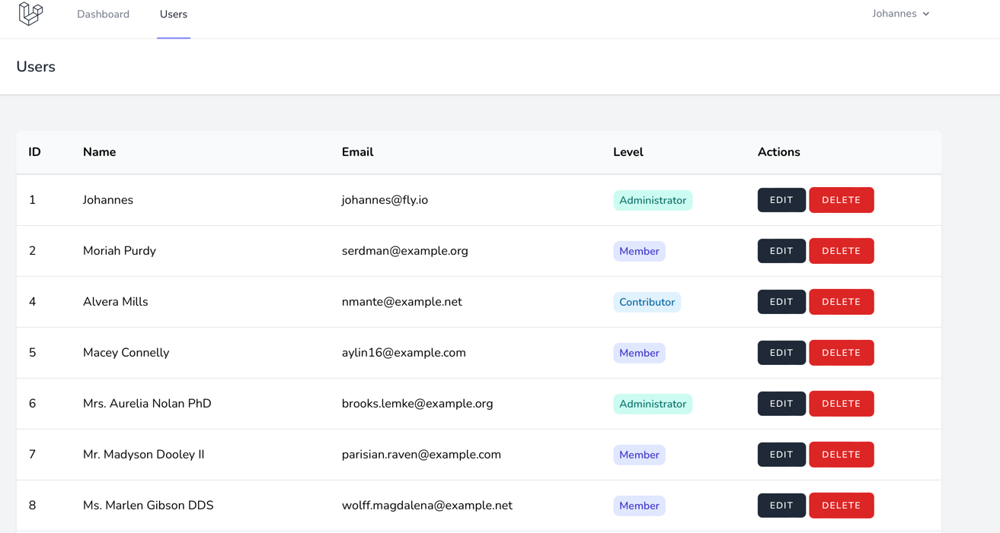

## User Levels, Enums and Policies, oh my!

This is the repository that goes alongside the [User Levels, Enums and Policies, oh my!](https://fly.io/laravel-bytes/user-levels-enums-and-policies-oh-my/) article on Fly.io.

In the article, I'll show how to set up an app where users can have 3 levels: Administrator, Contributor and Member. For that, we'll use the newly introduced Enum class that came with PHP 8.1. After that we'll set up some routes to edit user levels and delete other users, and finally we'll use policies to divide our users into 'cans' and 'cannots'.

Here are the steps in more detail:

- Create a Users page where users are listed
- Add a level to our User model
- Make it possible to edit User levels
- Use the User level to allow or deny access to functionality using a Policy
- Make it possible to delete Users

Along the way, we'll learn about PHP's new Enums, model casting and authorization using Laravel's policies.

Here's a quick preview of what the main view will look like: 

Every section in the article has its own pull request: 
1. [Displaying the Users](https://github.com/Johannes-Werbrouck/policies-levels-enums/pull/1)
2. [Leveling up the Users](https://github.com/Johannes-Werbrouck/policies-levels-enums/pull/2)
3. [Editing the Users](https://github.com/Johannes-Werbrouck/policies-levels-enums/pull/3)
4. [Protecting the Users](https://github.com/Johannes-Werbrouck/policies-levels-enums/pull/4)
5. [Destroying the Users](https://github.com/Johannes-Werbrouck/policies-levels-enums/pull/5)

Have fun!
